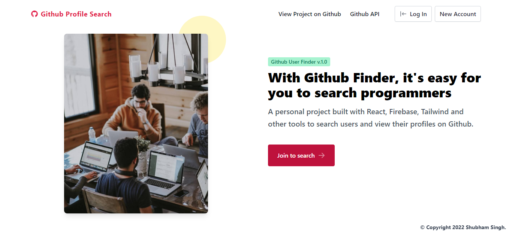
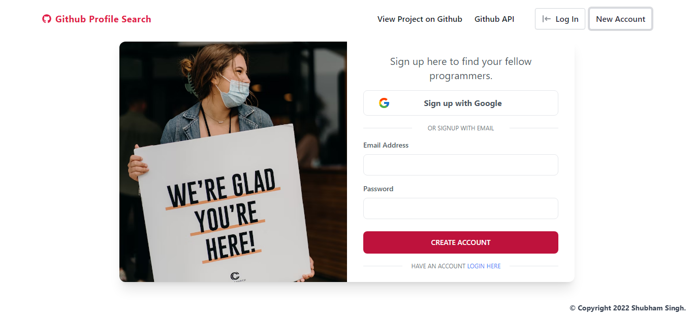
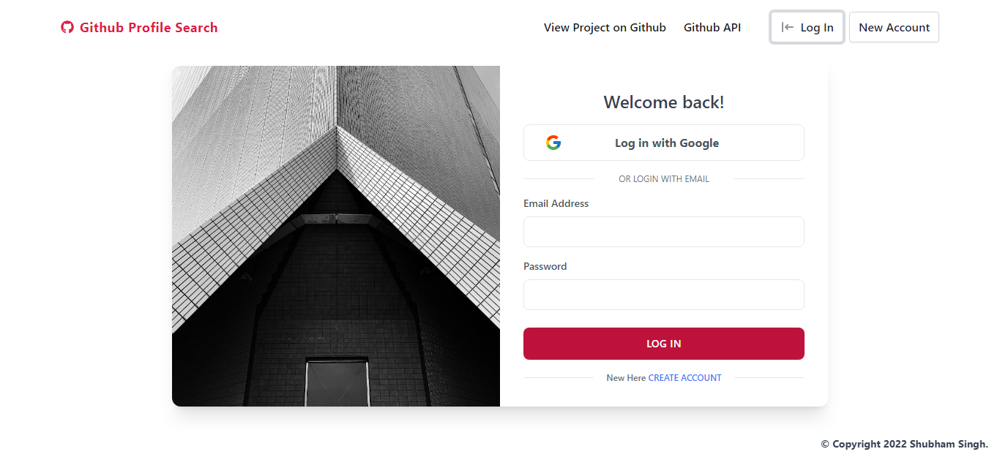
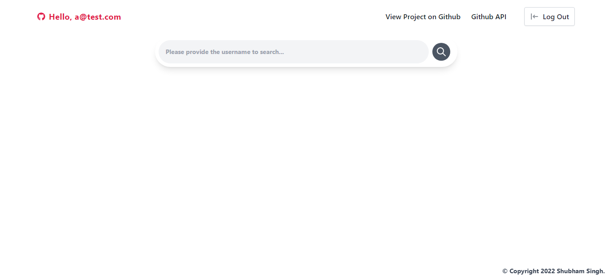
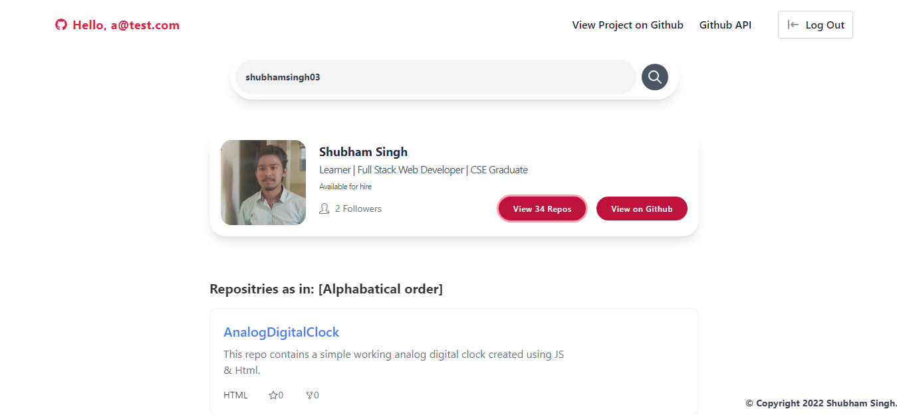

# Github User Finder

## Description

[**Github User Finder**](https://github-fireauth.netlify.app/) is built with React, Firebase, React-router, Tailwind css and other tools to search users and view their profiles on Github via Github API authenticated with Firebase authentication.

## Links for Project

- ### 📌 [LIVE Project Link](https://github-fireauth.netlify.app/)

- ### 📌 [YouTube Link](https://youtu.be/gpO7Ku74Bb8)

## Tech Stack Used

## Key features:

- User can signup or signin with email and password.

- User can search other fellow programmers and view their public info and repos

## Tools and libraries

- React

- React Router

- Firebase

- Tailwind css

- [Github API](https://docs.github.com/en/rest?apiVersion=2022-11-28)

- Axios

- React toastify

- Framer Motion

- Tailkit Components

## Project Screen Shot(s)

### Landing Page

### SignUp Page

### Login Page

### Home Page

### Search Result Home Page

## Checkout Portfolio & Other Projects

### ⭐ [Personal Portfolio](https://shubhambhoj.in)

## Connect with Me

- [Mailto](mailto:shubhambhoj3@gmail.com)

- [LinkedIn](https://www.linkedin.com/in/shubham-singh-b122b7171/)

---

[GO TO TOP](#github-user-finder)
